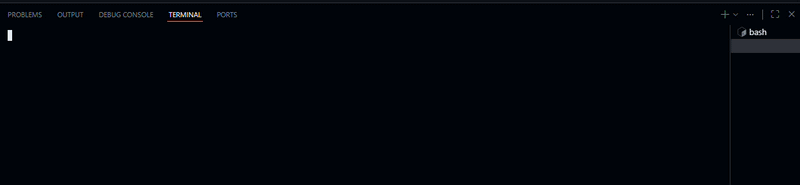

# bimahmood-abdulrahman-sabri-a-omar-202505010271-python-programing 
# IT Helpdesk Ticket Registration System

## Purpose of the Application
This application is used to register IT helpdesk tickets for students. It collects the student's information, issue details, location, and priority level. Based on the priority, the system assigns a technician automatically and displays the ticket.

## Tech Stack
- Python 3
- Modular Programming
- Functions
- Dictionary
- Input/Output

## How to Use
1. Open the project folder.
2. Run `main.py`.
3. Enter the student information.
4. Enter the issue, location, and priority (High/Medium/Low).
5. The system will assign a technician automatically.
6. The completed helpdesk ticket will be displayed.

## Demonstration
Run the application and record a short screen recording (Video/GIF) showing:
- Running `main.py`
- Entering the ticket details
- Displaying the final helpdesk ticket

